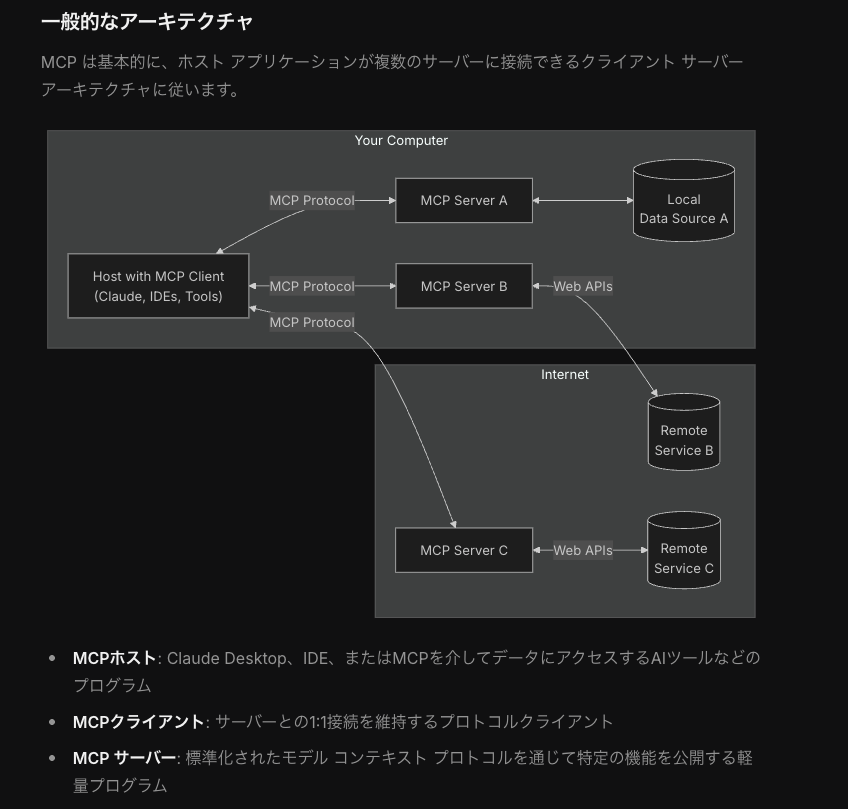

# MCPについて
MCPは、アプリケーションがLLMにコンテキストを提供する方法を標準化するオープンプロトコルです。

MCPはAIアプリケーション(Claude Desktop,chat gptなど)用のUSB-Cポートのようなもので、USB-Cがデバイスを様々な周辺機器やアクセサリに接続するための標準化された方法を提供するのと同様に、MCPはAIモデルを様々なデータソースや外部ツールに接続するための標準化された方法を提供するもの。

Anthropic社がはじめに提唱した規格です。

## MCPの一般的なアーキテクチャ

## AnthropicのMCPに関する公式ドキュメント
https://modelcontextprotocol.io/introduction

## MCPが解決する課題
例えば、あなたが開発している AI アシスタントに、カレンダー、メール、天気予報、株価情報など 10 種類のサービスと連携させたいとします。従来の方法では、10 種類の API それぞれに対して個別の連携コードを書く必要がありました。しかし、MCP を使えば、一度 MCP クライアントを実装するだけで、MCP に対応した全てのサービスと簡単に連携できるようになります。

