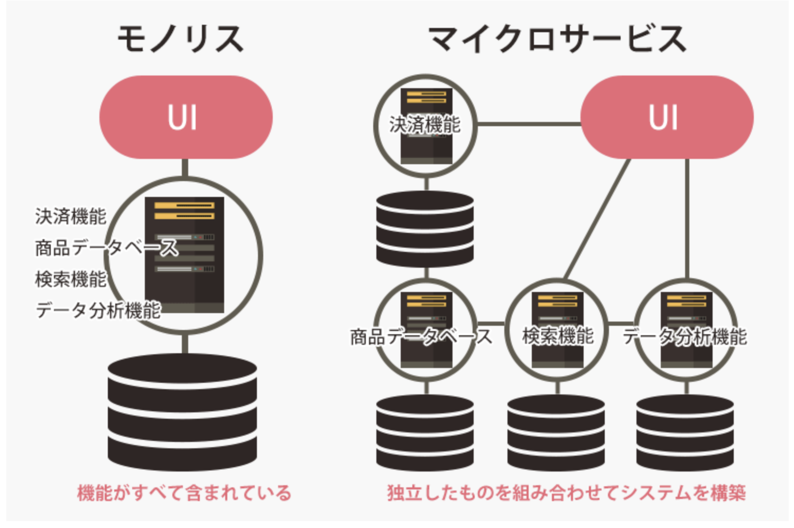

# 開発手法

### マイクロサービスアーキテクチャ
- マイクロサービスアーキテクチャは、アプリケーションを小さなサービスの集合として構築する手法です。(対義語: モノリスティックアーキテクチャ)
  #### <イメージ>

- メリット:
  - 保守のしやすさ: 小さなコードベースで管理が容易。全体像の把握がしやすい。
  - 再利用性: 小さなサービスを他のプロジェクトでも再利用可能。
  - テストの容易さ: 小さな単位でテストが可能。バグの特定が容易。
  - スケーラビリティ: 各サービスを独立してスケールできる。
  - デプロイの柔軟性: サービスごとに独立してデプロイ可能。一部機能の更新が他に影響を与えない。
  - 障害の分離: あるサービスの障害が他のサービスに影響を与えにくい。
  - 技術スタックの多様性: 各サービスで異なる技術を使用できる。人材の確保のしやすい言語に変更可能。
  - チームの独立性: 各チームが独自に開発できるため、開発のスピードが向上する。

- デメリット:
  - 複雑性の増加: サービス間の通信やデータの整合性を管理する必要がある。
  - 運用の難しさ: 多数のサービスを監視・管理する必要がある。 分割する単位は慎重に選ぶ必要がある。
  - ネットワークの遅延: サービス間通信が増えることで、ネットワークの遅延が問題になることがある。
--- 

### BFF
- BFF (Backend for Frontend) は、フロントエンドのニーズに特化したバックエンドサービスを提供する手法です。
  - BFFは、フロントエンドの要件に応じて異なるAPIを提供するため、フロントエンドの開発者が必要なデータを効率的に取得できるようになります。
  つまり、フロントエンドのパフォーマンスを最適化するために、必要なデータを集約し、不要なデータの取得を避けることができます。    
  